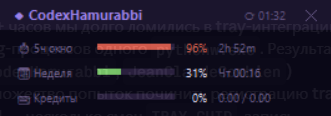
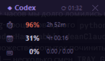
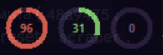

# CodexHamurabbi

> **The only usage monitor built specifically for the Codex Desktop app (Windows).**
> No password, no API key — uses the access token Codex Desktop already caches locally.

Compact always-on-top overlay that shows your real-time **Codex usage stats** — 5-hour window, weekly limit, and extra credits — directly on your desktop.

  

---

## What it shows

| Metric | Description |
|---|---|
| ⏱ **5h window** | 5-hour rolling window usage & time to reset |
| 📅 **Week** | 7-day total usage & time to reset |
| 💳 **Credits** | Extra credits used / monthly limit |

Color-coded progress bars / rings: green → yellow → red as limits approach.

**Four modes:**
- **Full** — progress bars + labels + reset countdowns
- **Compact** — icon + % + time to reset (165 px wide)
- **Dock** — donut-ring strip (44 px tall) that snaps above the Windows taskbar
- **Tray** — single status ring in the system tray; left-click for hover card, right-click for menu

Double-click the header to toggle full ↔ compact. Right-click for the full menu (modes, opacity, language, %).

---

## Languages

Right-click the overlay → **🌐 Language** to switch instantly. Setting persists across restarts.

| Code | Language |
|---|---|
| `en` | English |
| `fr` | Français |
| `es` | Español |
| `ru` | Русский |
| `lg` | Luganda |

Want to add your language? Edit [`i18n.py`](i18n.py) — copy any block, add a new key, translate the values. One file, no build step.

---

## Requirements

- **Windows 10 / 11**
- **Python 3.10+** — [python.org/downloads](https://python.org/downloads/) *(check "Add Python to PATH" during install)*
- **Codex Desktop app** — installed, signed in, and run at least once (any paid plan)

`install.bat` will pip-install `pystray` + `Pillow` (for tray-mode rendering).

---

## Installation

### 1. Download

Click **Code → Download ZIP**, extract anywhere. Or clone:
```
git clone https://github.com/tvagafonov-lab/CodexHamurabbi.git
cd CodexHamurabbi
```

### 2. Install

Double-click **`install.bat`** — installs dependencies and creates a Windows-startup shortcut so the overlay launches automatically on every login.

### 3. Run now

Double-click **`start_monitor.bat`** to launch immediately without waiting for the next login.

No setup wizard, no API keys. The overlay reads Codex Desktop's cached access token from:
```
%USERPROFILE%\.codex\auth.json
```
and queries the same backend endpoint Codex Desktop itself uses, so the numbers match the Codex UI exactly.

---

## Usage

**Controls:**
| Action | Result |
|---|---|
| Drag | Move the window anywhere |
| Double-click header | Toggle compact / full mode |
| Double-click (dock) | Exit dock mode |
| Right-click | Context menu (mode, %, opacity, language, close) |
| ✕ button | Close |

Settings saved to `%USERPROFILE%\.codex\hamurabbi_settings.json`.

---

## How it works

Codex Desktop signs you in via OAuth and stores the resulting access token in `~/.codex/auth.json`. CodexHamurabbi reads that file, sends a single authenticated `GET https://chatgpt.com/backend-api/codex/usage` request every 3 minutes, and surfaces:

```
rate_limit.primary_window    → 5-hour rolling window (used_percent, reset_at)
rate_limit.secondary_window  → weekly total (used_percent, reset_at)
credits                      → extra credits balance
```

Codex Desktop refreshes the token in place, so as long as Desktop is installed and you're signed in, CodexHamurabbi stays current with no manual maintenance. Sign out of Desktop and the overlay shows `⚠ no_data` until you sign back in.

---

## Files

```
CodexHamurabbi/
├── codex_monitor.py   # Main overlay (tkinter)
├── fetch_codex.py     # HTTP fetch from chatgpt.com/backend-api/codex/usage
├── i18n.py            # Translations — edit to add a language
├── install.bat        # One-click install + startup shortcut
├── start_monitor.bat  # Launch overlay (no install)
└── requirements.txt   # pystray + Pillow (for tray mode)
```

---

## Also using Claude Desktop?

Check out the sibling project:

**[JeanClaudeCombien](https://github.com/tvagafonov-lab/JeanClaudeCombien)** — same idea for Claude.
Shows 5h window, weekly limit, Sonnet usage, Design, and extra credits.

---

## Troubleshooting

**Window not visible**
→ Delete `%USERPROFILE%\.codex\hamurabbi_settings.json` and restart — reappears bottom-right.

**Shows `⚠ no_data`**
→ Codex Desktop is not signed in (or `~/.codex/auth.json` is missing). Open Codex Desktop and sign in.

**Tray icon doesn't appear**
→ Windows 11 hides new tray icons by default. Open **Settings → Personalization → Taskbar → Other system tray icons** and enable the CodexHamurabbi entry.

**"Python not found"**
→ Reinstall Python from [python.org](https://python.org/downloads/) and check **"Add Python to PATH"**.

---

## Privacy

The only outbound request is to `chatgpt.com/backend-api/codex/usage` — the same endpoint Codex Desktop uses for its own UI. No telemetry, no third-party services. The access token never leaves your machine except in that one request.

---

## Support the project

[](https://buymeacoffee.com/agafonov)

---

## License

MIT
